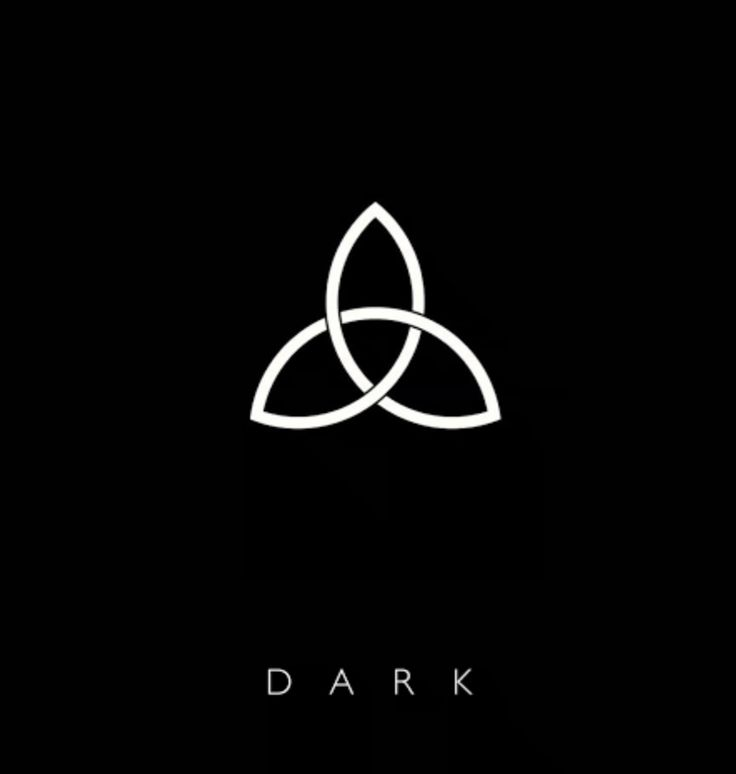

<div align="center">
  


# SIC MUNDUS

### An OWL ontology of Netflix's *Dark*

*A semantic representation of identities, temporal manifestations,
family paradoxes, worlds, events, and time travel.*

[Explore the website](https://sicmundusorganization.github.io/dark-ontology/) ·
[Browse the ontology](dark_ontology_populated.ttl)

</div>

---

## 🕰️ The project

*Dark* is a narrative built on an extraordinary density of relationships: intertwined family trees, multiple timelines, temporal manifestations, parallel worlds, and events whose causes and consequences cross the boundaries of time.

This complexity makes the series an especially interesting domain for semantic modelling.

**Sic Mundus** is an OWL ontology designed to represent the narrative universe of *Dark* in a structured, machine-readable, and queryable form. It models characters, their temporal manifestations, family relationships, worlds, realities, places, events, time-travel devices, and temporal entities.

The project investigates how formal knowledge representation can describe a fictional universe in which:

* the same person exists through different temporal manifestations;
* identities can change name, age, family, and social role;
* events connect different years, places, worlds, and realities;
* family relationships can become temporally paradoxical;
* causes and consequences do not follow a simple linear chronology.

---

## ❓ Research question

> How can a person be distinguished from their different temporal manifestations while preserving a common identity and representing changes in name, age, role, family, world, and time?

The conceptual core of the ontology is the distinction between:

* **Person** — the persistent personal identity that remains stable across time and worlds;
* **PersonManifestation** — the form in which that person exists under specific temporal and narrative conditions.

For example, `MikkelNielsen` represents one persistent person, while `Mikkel_2019` and `Michael_2019` represent two manifestations of that same identity.

```text
Mikkel_2019  ── manifestationOf ──▶  MikkelNielsen
Michael_2019 ── manifestationOf ──▶  MikkelNielsen
```

This distinction makes it possible to preserve personal identity without treating every temporal version of a character as a completely separate person.

---

## 🔎 Research background

During the preliminary research conducted for this project, no official or widely standardised OWL/RDF ontology specifically dedicated to *Dark* was identified.

Several existing projects demonstrate that the universe of the series can be represented as a network of entities and relationships:

* [Graph Analysis and Relationship Extraction from *Dark*](https://meysamraz.medium.com/graph-analysis-and-relationship-extraction-from-dark-tv-series-a8b61dd45da9)
* [Dark Characters Network](https://github.com/paulozip/dark_characters_network)
* [Netflix's official interactive *Dark* website](https://dark.netflix.io/)

These resources organise, extract, or visualise information about characters and their relationships. However, they do not provide the formal semantic layer required to define the meaning, hierarchy, domain, range, and logical characteristics of those relationships in OWL/RDF.

This gap provides the starting point for **Sic Mundus**.

The objective is therefore to move from simply *connecting* information to formally representing:

* what each entity is;
* how entities relate to one another;
* under which temporal and narrative conditions those relationships hold;
* which new facts can be inferred through ontological reasoning.

---

## 🧩 Ontology architecture

The ontology is organised around the following principal classes:

* `Person`
* `PersonManifestation`
* `Family`
* `Reality`
* `World`
* `Place`
* `TemporalEntity`
* `Event`
* `TimeTravelDevice`
* `Organization`
* `Role`

Some classes are further organised into more specific subclasses.

```text
Event
├── ApocalypseEvent
├── DisappearanceEvent
├── MeetingEvent
└── TimeTravelEvent

Place
└── InterworldSpace

TemporalEntity
└── TimeInterval
    └── Year

Role
├── OrganizationRole
└── ProfessionalRole
```

---

## 🔗 Main relationships

The ontology uses object properties to represent identity, family, temporal, spatial, and narrative relationships.

Some of the principal properties are:

* `hasManifestation`
* `manifestationOf`
* `parentOf`
* `childOf`
* `siblingOf`
* `spouseOf`
* `memberOfFamily`
* `hasFamilyMember`
* `existsDuring`
* `existsInWorld`
* `occursAtTime`
* `occursAtPlace`
* `occursInWorld`
* `occursInReality`
* `hasParticipant`
* `hasTraveler`
* `usesDevice`
* `departsFromTime`
* `arrivesAtTime`
* `departsFromPlace`
* `arrivesAtPlace`
* `departsFromWorld`
* `arrivesInWorld`

Data properties describe literal values associated with the entities:

* `hasAge`
* `hasCanonicalName`
* `hasDescription`
* `hasManifestationName`
* `hasSourceReference`
* `hasYearValue`
* `isIntentional`

The complete list of classes and properties is available in the ontology documentation section of the website and in the Turtle source file.

---

## 🧪 Case studies

### Mikkel Nielsen and Michael Kahnwald

Mikkel and Michael coexist in `Year_2019` with different names, ages, and families, while remaining manifestations of the same persistent person.

```text
Mikkel_2019
    manifestationOf → MikkelNielsen
    hasAge → 11
    memberOfFamily → NielsenFamily

Michael_2019
    manifestationOf → MikkelNielsen
    hasAge → 44
    memberOfFamily → KahnwaldFamily
```

This case demonstrates why the ontology distinguishes a persistent person from their temporally situated manifestations.

### The Charlotte–Elisabeth paradox

Charlotte Doppler is Elisabeth Doppler's mother, while Elisabeth is also Charlotte's mother.

```text
CharlotteDoppler ── parentOf ──▶ ElisabethDoppler
CharlotteDoppler ◀─ parentOf ─── ElisabethDoppler
```

Consequently, `parentOf` cannot be modelled as an asymmetric property in this domain. It remains irreflexive because neither character is a parent of herself.

This case demonstrates how the narrative structure of *Dark* challenges assumptions that would normally be reasonable when modelling family relationships.

---

## 💡 Knowledge Extraction: The SPARQL Queries

After structuring the domain knowledge into an OWL ontology, the project’s focus shifted to knowledge extraction. The goal was to answer specific, complex questions about the interconnected world of Dark. This was achieved by formulating a set of Competency Questions (CQs) that capture the most intriguing and characteristic aspects of the series.

The following CQs were defined:

CQ01 — Which persons have multiple temporal manifestations, and what are those manifestations?

CQ02 — Which time-travel events occur, who travels, and how and when does each journey take place?

CQ03 — What family and interpersonal relationships connect each person to others and to their family?

CQ04a — Which events occur across the different worlds, when and where do they take place, and who participates in them?

CQ04b — Which events involve different temporal manifestations of the same person meeting each other?

CQ05 — Which persons can be automatically classified as time travelers based on their temporal manifestations?

These questions are not just arbitrary; they are designed to synthesize and highlight the most narrative-rich elements of the ontology. For instance, they allow us to explore paradoxical self-encounters (CQ04b), trace the complex family trees that weave the entire plot together (CQ03), and identify characters who actively alter the timeline (CQ05).

---

## 🔗 From Competency Questions to SPARQL Queries

The transition from CQs to executable SPARQL queries is the core of this knowledge extraction phase. Each query was engineered to interrogate the relationships encoded in the ontology, leveraging features like:

* Property paths to traverse complex family connections.

* Grouping and aggregation to consolidate multiple manifestations under a single person.

* Filters and optional patterns to handle the nuances of incomplete or branching narrative data.

* Inference-based queries (e.g., classifying a TimeTraveler) to automatically derive new knowledge.

The ontology is fully queryable via a public SPARQL endpoint hosted on TriplyDB. You can explore and run all the queries directly at the following address:

🔗 https://triplydb.com/SilviaAntonellaPellicano/darkontology/sparql

This endpoint allows anyone to interact with the knowledge graph, test new questions, and verify the existing ones without needing to set up a local environment.

---

## 📁 Repository structure

```text
.
├── assets/
│   ├── css/
│   │   └── main.css
│   ├── img/
│   │   ├── characters/
│   │   ├── Triquetra.png
│   │   ├── favicon.png
│   │   └── ...
│   └── js/
│       └── main.js
├── queries/
│   ├── CQ1/
│   ├── CQ2/
│   ├── CQ3/
│   ├── CQ4a/
│   ├── CQ4b/
│   └── CQ5/
├── dark_ontology_populated.ttl
├── dark_ontology_structure.ttl
├── index.html
└── README.md
```

* `dark_ontology_structure.ttl` contains the conceptual structure of the ontology.
* `dark_ontology_populated.ttl` contains the populated ontology and its individuals.
* The .txt files contain the SPARQL queries.
* The CSV files contain the results of the competency-question queries.
* The website offers an interactive visual presentation of the ontology.

---

## 🛠️ Technologies

* **OWL 2**
* **RDF**
* **Turtle**
* **SPARQL**
* **Protégé**
* **HTML**
* **CSS**
* **JavaScript**

---

## ♾️ Philosophical background

Beyond its science-fiction framework, *Dark* explores time, causality, identity, determinism, and the possibility of free will.

The ontology is informed by the philosophical themes that structure the series:

* **Nietzsche's eternal recurrence** — existence is experienced as cyclical repetition;
* **Leibniz's principle of sufficient reason** — every event belongs to a broader causal structure;
* **Schopenhauerian determinism** — characters can act according to their desires but cannot choose the forces that produce those desires;
* **existential dread** — identity and meaning are negotiated inside an apparently predetermined universe;
* **the bootstrap paradox** — causes and consequences form self-sustaining temporal loops.

> “The distinction between past, present and future is only a stubbornly persistent illusion.”
> — Albert Einstein

The tragedy of *Dark* lies not in the characters' lack of effort to break the cycle, but in the possibility that each act of resistance is precisely what binds the knot tighter.

---

## 🎓 Academic context

**Sic Mundus** was developed for the **Knowledge Representation and Knowledge Extraction** course, taught by **Professor Aldo Gangemi**, within the [Digital Humanities and Digital Knowledge Master's Degree](https://corsi.unibo.it/2cycle/DigitalHumanitiesKnowledge) at the University of Bologna.

---

## 👥 Authors

* [Maria Concetta De Matteis](https://github.com/maridematteis)
* [Silvia Antonella Pellicano](https://github.com/silviapellicano30)

---

## ⚠️ Disclaimer

This is an academic and non-commercial project inspired by Netflix's *Dark*.

All names, characters, images, quotations, and narrative references related to the series belong to their respective copyright holders. The project is not affiliated with or endorsed by Netflix or the creators of *Dark*.
